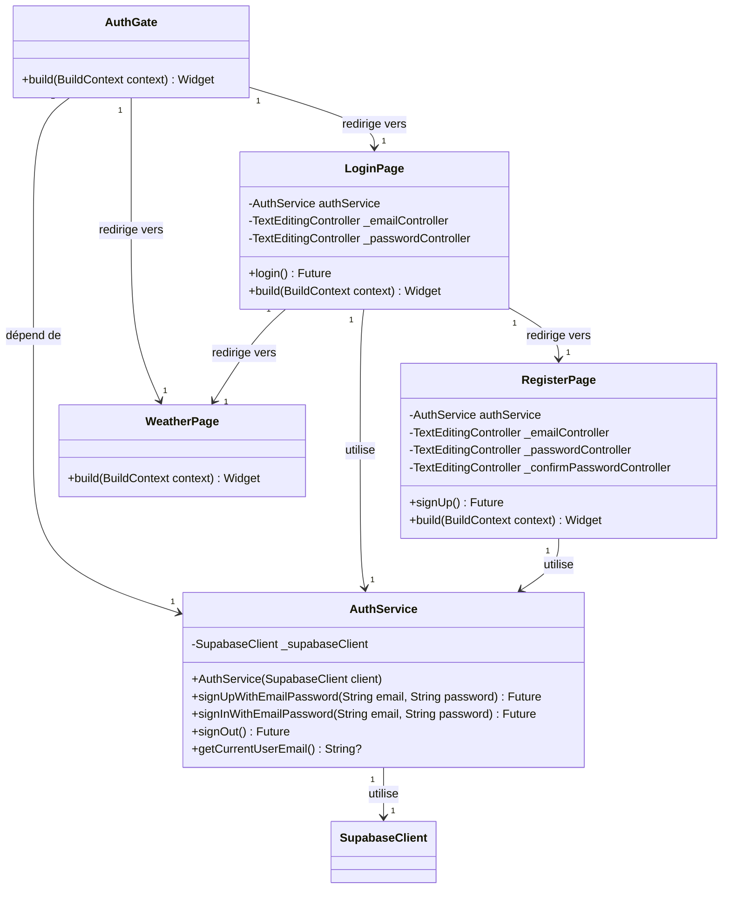

```mermaid
classDiagram
    class AuthService {
        -SupabaseClient _supabaseClient
        +AuthService(SupabaseClient client)
        +signUpWithEmailPassword(String email, String password) Future<void>
        +signInWithEmailPassword(String email, String password) Future<void>
        +signOut() Future<void>
        +getCurrentUserEmail() String?
    }

    class AuthGate {
        +build(BuildContext context) Widget
    }

    class LoginPage {
        -AuthService authService
        -TextEditingController _emailController
        -TextEditingController _passwordController
        +login() Future<void>
        +build(BuildContext context) Widget
    }

    class RegisterPage {
        -AuthService authService
        -TextEditingController _emailController
        -TextEditingController _passwordController
        -TextEditingController _confirmPasswordController
        +signUp() Future<void>
        +build(BuildContext context) Widget
    }

    class WeatherPage {
        +build(BuildContext context) Widget
    }

    AuthService "1" --> "1" SupabaseClient : utilise
    AuthGate "1" --> "1" AuthService : dépend de
    LoginPage "1" --> "1" AuthService : utilise
    RegisterPage "1" --> "1" AuthService : utilise
    AuthGate "1" --> "1" LoginPage : redirige vers
    AuthGate "1" --> "1" WeatherPage : redirige vers
    LoginPage "1" --> "1" RegisterPage : redirige vers
    LoginPage "1" --> "1" WeatherPage : redirige vers
```