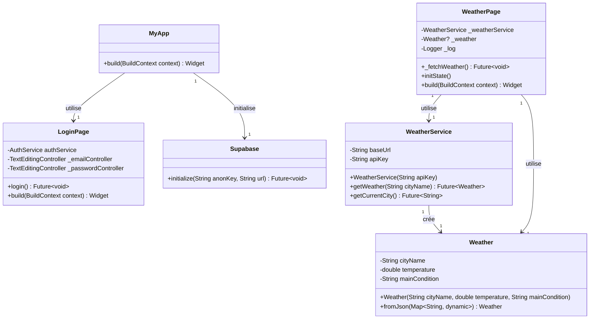

```mermaid
classDiagram
    class MyApp {
        +build(BuildContext context) Widget
    }

    class WeatherService {
        -String baseUrl
        -String apiKey
        +WeatherService(String apiKey)
        +getWeather(String cityName) Future~Weather~
        +getCurrentCity() Future~String~
    }

    class WeatherPage {
        -WeatherService _weatherService
        -Weather? _weather
        -Logger _log
        +_fetchWeather() Future~void~
        +initState()
        +build(BuildContext context) Widget
    }

    class Weather {
        -String cityName
        -double temperature
        -String mainCondition
        +Weather(String cityName, double temperature, String mainCondition)
        +fromJson(Map~String, dynamic~) Weather
    }

    class LoginPage {
        -AuthService authService
        -TextEditingController _emailController
        -TextEditingController _passwordController
        +login() Future~void~
        +build(BuildContext context) Widget
    }

    class Supabase {
        +initialize(String anonKey, String url) Future~void~
    }

    MyApp "1" --> "1" LoginPage : utilise
    WeatherPage "1" --> "1" WeatherService : utilise
    WeatherService "1" --> "1" Weather : crée
    WeatherPage "1" --> "1" Weather : utilise
    MyApp "1" --> "1" Supabase : initialise
```